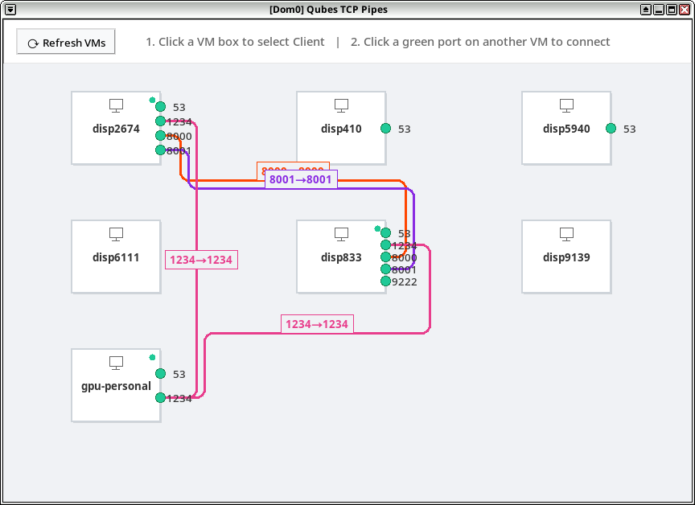

# Qubes TCP Pipes

A lightweight GUI tool for Qubes OS to easily create temporary `qubes.ConnectTCP` pipes between VMs for development and testing.



## Overview

Creating TCP pipes in Qubes OS using `qubes.ConnectTCP` can be a tedious process involving manual policy configuration and command-line setup. **Qubes TCP Pipes** simplifies this by providing a point-and-click interface to visualize running VMs and their listening services, allowing you to establish connections instantly.

## Features

- **VM Visualization**: Lists all running VMs (excluding system VMs and specified excluded ones).
- **Automatic Port Discovery**: Scans VMs for TCP services listening on `localhost` or all interfaces.
- **Point-and-Click Connectivity**:
    1. Select a source VM (Client).
    2. Click a listening port on a destination VM (Server) to create the pipe.
- **Temporary by Design**: 
    - Policies are written to a temporary file: `/etc/qubes/policy.d/30-dev-tcp-temp.policy`.
    - All created pipes and policy rules are automatically cleaned up when the application is closed or interrupted.
- **Manage Connections**: Right-click an existing connection line to sever it.

## Prerequisites

This tool is intended to be run on **dom0**. 

### Dependencies
You must install `python3-tkinter` on dom0:
```bash
sudo qubes-dom0-update python3-tkinter
```

⚠️ **Warning**: Installing third-party software or packages on dom0 is generally discouraged in Qubes OS for security reasons. Use this tool at your own risk and only for development/testing purposes.

## Usage

1. Ensure `python3-tkinter` is installed.
2. Run the application:
   ```bash
   # Development (from source tree)
   python3 main.py

   # Or build a single-file for easy deployment:
   bash build.sh          # produces qubes-tcp-pipes.py
   python3 qubes-tcp-pipes.py
   ```
3. **To create a connection**:
   - Click on a VM box to select it as the **Client**.
   - Click on a green port circle of another VM to set it as the **Server**.
4. **To remove a connection**:
   - Right-click the connection line and confirm deletion.
5. **To cleanup**:
   - Simply close the application window — all pipes and policy rules are removed automatically.

## How it Works

- **Discovery**: Uses `qubesadmin` to list VMs and `ss -ltn` via `qvm-run` to find listening TCP ports inside each VM.
- **Connectivity**: 
    - Generates a `qubes.ConnectTCP` policy rule and appends it to `/etc/qubes/policy.d/30-dev-tcp-temp.policy`.
    - Executes `qvm-connect-tcp` to establish the bridge.
- **Cleanup**: Uses Python's `atexit` and signal handlers to remove the temporary policy file and terminate `socat` processes associated with the pipes.

## Disclaimer

This is a development tool and is not intended for production use or permanent infrastructure. It is provided "as-is" without warranty.
